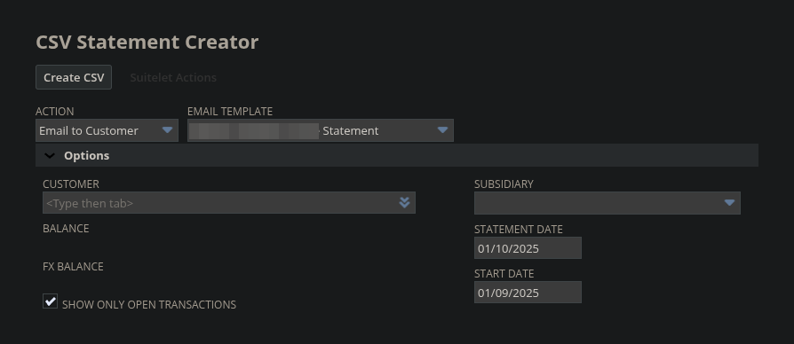

<!-- BEGIN ARISE ------------------------------
Title:: "CSV Statements"

Author:: "bigbardwolf"
Description:: "CSV Statement creation via HTML rendering and XPath processing"
Language:: "en"
Thumbnail:: "csv-statements.png"
Published Date:: "2025-10-07"
Modified Date:: "2025-10-07"

---- END ARISE \\ DO NOT MODIFY THIS LINE ---->

**Summary**

CSV Statement creation can be achieved relatively easily with a modified Advanced PDF template rendered in the HTML format. By adding IDs to the relevant data tags, they remain in the generated HTML allowing retrieval with XPath processing of the file contents.

**Suitelet UI**

An interface Suitelet was created to mimic the layout of the "Print Individual Statement" functionality of NetSuite with the exclusion of form selection, this will be hard-coded to use the prepared template with added IDs. 



**Template Setup**

The statement data is gathered by using the N/render module with the mentioned PDF template and UI options. Each piece of data in the template that is needed for the CSV will require an ID in the template tag (e.g. the tag containing the balance value could have "statement-balance" as the ID.) The statement lines will require a counter variable before iteration, with the value incremented each line. The counter value can then be appended to a "line-" ID to allow each to be indexed for the next step. Example Statement lines:

```html
<#assign counter = 0>
<table>
<#list statement.lines as line>
  <#if line_index==0>
    <thead>
      <tr id="statement-headers">
        <th colspan="2">${record.lines.datecol@label}</th>
        <th colspan="2">${record.lines.description@label}</th>
        <th colspan="2">${record.lines.charge@label}</th>
        <th colspan="2">${record.lines.payment@label}</th>
        <th colspan="2">${record.lines.balance@label}</th>
      </tr>
    </thead>
  </#if>
  <tr id="line-${counter}">
    <td colspan="2">${line.datecol}</td>
    <td colspan="2">${line.description}</td>
    <td colspan="2">${line.line.charge}</td>
    <td colspan="2">${line.line.payment}</td>
    <td colspan="2">${line.line.balance}></td>
  </tr>
  <#assign counter = counter + 1>
  </#list>
</table>
```

**Getting the Data**

The application will function by rendering a statement with this template, but in the HTML format instead of PDF. When rendering this way, the output will maintain the tags entered in the statement template, allowing XPath querying of the data it contains.
Example XPath processing of rendered statement lines:

```javascript
let csvData = { lines: [] };
let file = nRender.statement(data.params);

// Convert rendered file to string
const parsed = nXml.Parser.fromString({ text: file.getContents() });

// Pull out Statement Line elements
const lines = nXml.XPath.select({
  node: parsed,
  xpath: `//table//tr[starts-with(@id, '${ROW_ID_PREFIX}')]`
});

// Iterate through lines and get values
for (let line of lines)
{
  const lineData = nXml.XPath.select({
    node: line,
    xpath: 'td'
  });

  csvData.lines.push(lineData.map(row => {
    return row.textContent
        .replaceAll(',', '')
        .replaceAll('\n', '');
  }));
}
```
